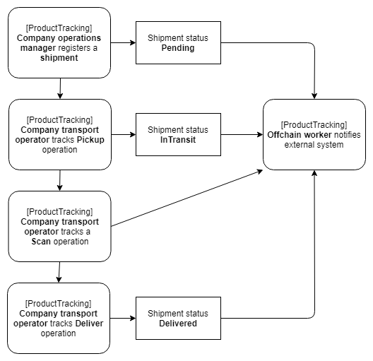

# Substrate Product Tracking pallet

The Product Tracking pallet provides functionality for registering and tracking shipments, and monitoring their storage and transportation conditions, within a fictitious supply chain between various stakeholders.
The high-level flow is shown below.



This pallet is part of the [Substrate Enterprise sample](https://github.com/gautamdhameja/substrate-enterprise-sample).

It is inspired by existing projects & standards:
- [IBM Food Trust](https://github.com/IBM/IFT-Developer-Zone/wiki/APIs)
- [Hyperledger Grid](https://www.hyperledger.org/use/grid)
- [GS1 Standards](https://www.gs1.org/standards)

NOTE: This pallet implements the aforementionned process in a simplified way, thus it is intended for demonstration purposes and is not audited or ready for production use.

## Usage

### Register a shipment

To register a shipment, one must send a transaction with a `productTracking.registerShipment` extrinsic with the following arguments:
- `id` as the Shipment ID, an arbitrary numeric or alpha-numeric code that uniquely identifies the shipment.
- `owner` as the Substrate Account representing the person (or function within an organization) responsible for the shipping process of the given shipment.
- `products` which is a series of product IDs associated with the given shipment.

### Tracking a shipment

When a shipment has been registered, shippting events occuring during the shipment's lifecycle can be recorded on-chain by sending a `productTracking.trackShipment` extrinsic with the following argmuments:
- `id` is the Shipment ID which identifies which shipment is being tracked.
- `operation` as the business operation that took place during the shipping process: `Pickup`, `Scan` or `Deliver`.
- `timestamp` as time (represented as UNIX time) at which the event was captured by an external system or sensor.
- `location` is an optional `ReadPoint` which contains the geographic position (`latitude` and `longitude`) where the event was captured.
- `readings` which is an optional series of `Reading` that represent data captured by various sensors (humidity, Temperature, vibration, etc). A `Reading` includes a `device_id` (unique idenfitier of the device), a `reading_type` (type of sensor / measurement, see `ReadingType` enum), a `timestamp` (time at which the reading was recorded), and a `value` as the actual measurement recorded by the sensor.

## Dependencies

### Traits

This pallet does not depend on any externally defined traits.

### Pallets

This pallet depends on on the [FRAME Timestamp](https://docs.rs/crate/pallet-timestamp) & [Product registry](https://github.com/stiiifff/pallet-product-registry) pallets.

## Testing

Run the tests with:

    ```
    cargo test
    ```

## How to use in your runtime

### Runtime `Cargo.toml`

To add this pallet to your runtime, simply include the following to your runtime's `Cargo.toml` file:

```TOML
[dependencies.product-tracking]
default_features = false
git = 'https://github.com/stiiifff/pallet-product-tracking.git'
package = 'pallet-product-tracking'
version = '2.0.0-rc4'
```

and update your runtime's `std` feature to include this pallet:

```TOML
std = [
    # --snip--
    'product-tracking/std',
]
```

### Runtime `lib.rs`

You should implement it's trait like so:

```rust
/// Used for test_module
impl product_tracking::Trait for Runtime {
	type Event = Event;
}
```

and include it in your `construct_runtime!` macro:

```rust
ProductTracking: product_tracking::{Module, Call, Storage, Event<T>},
```

### Genesis Configuration

This template pallet does not have any genesis configuration.

## Reference Docs

You can view the reference docs for this pallet by running:

```
cargo doc --open
```
